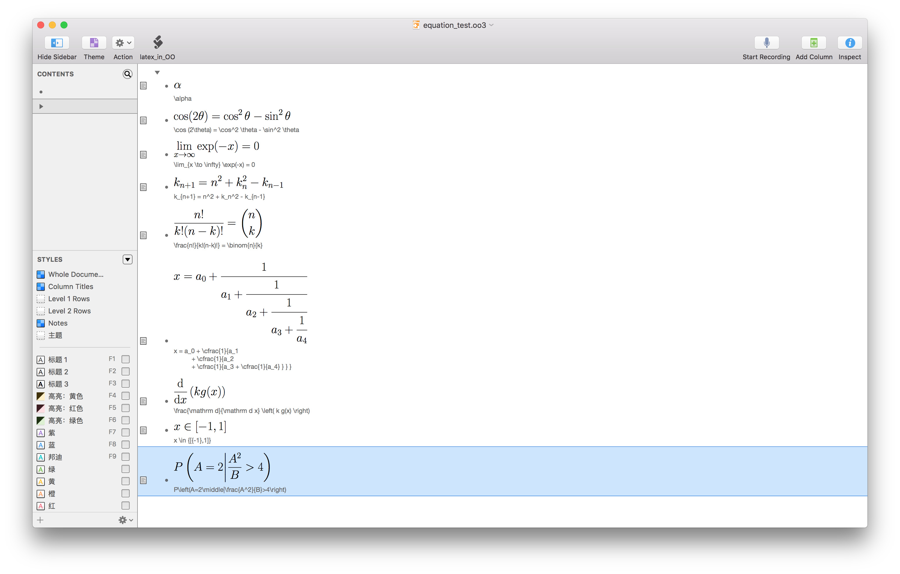

# Latex in OO (OmniOutliner)

## Introduction

OmniOutliner always used for note taking, for some area, latex equations play an important role. However, OmniOutliner does not support latex equations which may cause inconvenience to the user. Here a python script and an applescript are generated to provide a simple solution for this problem. 

Users can write their latex equations in the note and generate a .pdf attachment for the selected row.

The script can:

- get content of note of selected row which should be a latex equation
- pass the string of the content to the python script that generates a pdf of the latex string
- paste the generated pdf of that latex string at the end of the selected row (not the note, the note stays there, found to be useful for future reference)

## How to use

* put the `latex_in_OO.scpt` into `~/Library/Application Scripts/com.omnigroup.OmniOutliner4/`(if not exists create the folder)

* put the `create_latex_pdf.py` into `/Documents/OmniOutliner4` (if not exists create a folder)

* then you can access the script from the script icon in the menubar (can be set in View->Customize Toolbar)

  ​

## Requirement

MacTeX 2015

python 

[pdfcrop](http://pdfcrop.sourceforge.net/)

## Test in OmniOutliner

Result:

 

Environment: 

* OS: OSX EI Capitan(10.11.4)

* Software: OmniOutliner v4.5, MacTeX 2015, python 2.7.10, pdfcrop v0.4b, etc.

##Reference

The small scripts are modified from [OO_latex](https://github.com/clausTue/OO_latex) since Omnigroup change the path to store applescript and the upgrade of MacTeX.